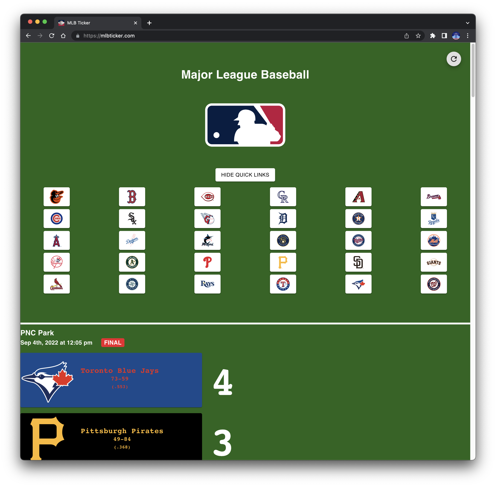
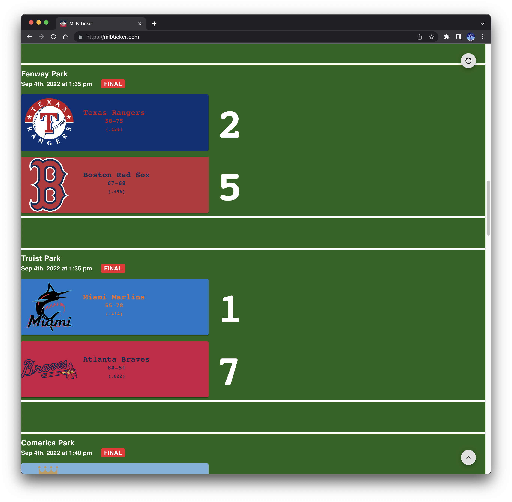

# MLB Ticker

## Copyright

The accounts, descriptions, data and presentation in the referring page (the "Materials") are proprietary content of MLB Advanced Media, L.P ("MLBAM").  
Only individual, non-commercial, non-bulk use of the Materials is permitted and any other use of the Materials is prohibited without prior written authorization from MLBAM.  
Authorized users of the Materials are prohibited from using the Materials in any commercial manner other than as expressly authorized by MLBAM.

## Description

Provides live scoreboard of all Major League Baseball games.

## Technologies

- [React](https://reactjs.org/)
- [Material UI](https://mui.com/)
- [Axios](https://axios-http.com/docs/intro)

- MLB Data provided by [Stats API](https://statsapi.mlb.com/) and property of [Major League Baseball](https://mlb.com)

## Screenshots

## Contributors

Andrew Keiser [Github](https://github.com/webdev410)